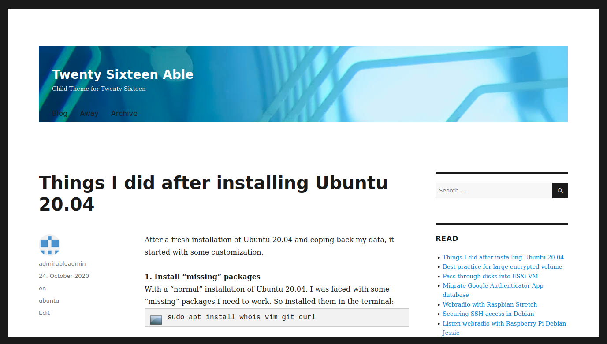

# twentysixteenable
Child Theme for Twenty Sixteen

_Since I really like the K2 theme for wordpress, which hasn't been developed further for a long time, I have my own [fork of K2](https://github.com/admirableadmin/k2-for-wordpress) for minor adjustments. With every new Wordpress version and higher PHP versions, it gets complicated. So the goal is to transfer the basic look of K2 to another theme._



## Features

* remove google fonts - hello DSGVO
* remove meta tag which displays the wordpress version number
* added random backgound image to header
* added header images with 1200x280 pixel
* added custom block styling images to frontend and backend

## Setup

[Download ZIP](https://github.com/admirableadmin/twentysixteenable/archive/refs/heads/main.zip) and extract it to `wp-content/themes/twentysixteenable` and activate the theme in Wordpress, i.e.

```
wget -O twentysixteenable.zip https://github.com/admirableadmin/twentysixteenable/archive/refs/heads/main.zip
unzip twentysixteenable.zip
mv twentysixteenable-main/ /var/www/blog/wp-content/themes/twentysixteenable
```
